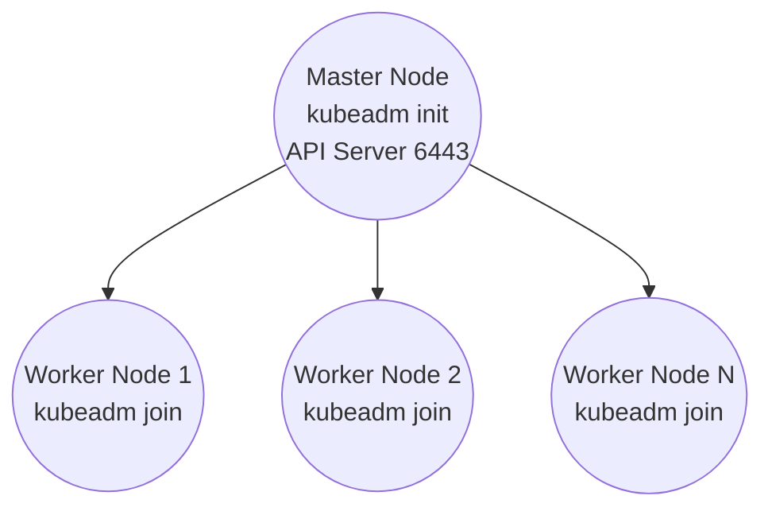

# k8s-installer

<p align="center">
  <a href="https://github.com/asepindrak/k8s-installer/blob/main/LICENSE">
    
  </a>
  
  
  
</p>

---

# Overview

`k8s-installer` is a fully automated installer for setting up a Kubernetes cluster using **kubeadm** and **containerd**, supporting:

- Ubuntu 20.04 / 22.04 / 24.04
- WSL2 multi-node clusters (e.g., master + worker)
- Single or multi-node Kubernetes clusters
- Auto installation for all dependencies

---

# 📦 Download

**Download ZIP:**  
https://github.com/asepindrak/k8s-installer/archive/refs/heads/main.zip

*(Replace with your actual repo URL.)*

---

# 📁 Repository Contents

```
scripts/common.sh      # shared helper functions and package installation
scripts/master.sh      # run on master; performs kubeadm init + installs CNI
scripts/worker.sh      # run on worker; joins to control plane
scripts/fetch-join.sh  # optional helper for scp join command
examples/kubeadm-config.yaml.example
```

---

# 🏗 Architecture Diagram (ASCII)

```
         +----------------------+
         |     MASTER NODE     |
         |----------------------|
         | kubeadm init        |
         | API Server : 6443   |
         | etcd                |
         | scheduler           |
         | controller-manager  |
         +----------+----------+
                    |
                    | kubeadm join
                    |
     +--------------+-------------------+
     |              |                   |
+----+----+    +----+----+        +-----+----+
| WORKER1 |    | WORKER2 |   ...  | WORKER-N |
|---------|    |---------|        |----------|
| kubelet |    | kubelet |        | kubelet  |
| pods    |    | pods    |        | pods     |
+---------+    +----------+        +----------+
```

---

# 🧩 Architecture Diagram (Mermaid)



---

# 🚀 Installation Guide

## 1) Clone repository (Master & Worker)

```bash
git clone https://github.com/asepindrak/k8s-installer.git
cd k8s-installer/scripts
chmod +x *.sh
```

Optionally install common.sh system-wide:

```bash
sudo cp common.sh /usr/local/bin/common.sh
sudo chmod +x /usr/local/bin/common.sh
```

---

# 🖥 2) Install on MASTER Node


#### update repos & install conntrack
```bash
sudo apt update
sudo apt install -y conntrack
```

#### verify
```bash
which conntrack || echo "conntrack not found"
conntrack -V || true
```

### Detect Master IP

```bash
MASTER_IP=$(ip -4 addr show eth0 | grep -oP '(?<=inet\s)\d+(\.\d+){3}')
echo $MASTER_IP
```

### Run master setup

```bash
sudo ./master.sh --apiserver-advertise-address "$MASTER_IP" --pod-cidr 10.244.0.0/16
```

This will:
- Install containerd
- Install kubeadm, kubelet, kubectl
- Disable swap
- Initialize cluster
- Install Flannel CNI
- Save join command to `/root/kubeadm-join.sh`

### View join command

```bash
sudo cat /root/kubeadm-join.sh
```

---

# 👷 3) Install on WORKER Node

### Option A — Direct join command

```bash
sudo ./worker.sh --join "kubeadm join <MASTER-IP>:6443 --token <token> --discovery-token-ca-cert-hash sha256:<hash>"
```

### Option B — Using fetch-join.sh

```bash
./fetch-join.sh ubuntu@master:/root/kubeadm-join.sh
sudo ./worker.sh --join "$(cat kubeadm-join.sh)"
```

---

# 🧪 4) Verify Cluster

```bash
kubectl get nodes -o wide
kubectl get pods -A
```

To allow master to run workloads:

```bash
kubectl taint node $(hostname) node-role.kubernetes.io/control-plane- || true
```

---

# 🔧 WSL2 Multi‑Node Setup (Optional)

### Duplicate Ubuntu distro

```powershell
wsl --export Ubuntu base.tar
mkdir C:\WSL\ubuntu-master
mkdir C:\WSL\ubuntu-worker

wsl --import ubuntu-master C:\WSL\ubuntu-master base.tar --version 2
wsl --import ubuntu-worker C:\WSL\ubuntu-worker base.tar --version 2
```

Enter each distro:

```powershell
wsl -d ubuntu-master
wsl -d ubuntu-worker
```

Then follow installation steps as usual.

Enable systemd inside each distro:

```
/etc/wsl.conf
[boot]
systemd=true
```

Then:

```powershell
wsl --shutdown
```

---

# 🧹 Cleanup

```bash
sudo kubeadm reset -f
sudo systemctl stop kubelet
sudo systemctl stop containerd
sudo rm -rf /etc/cni/net.d /var/lib/cni /var/lib/kubelet /etc/kubernetes ~/.kube
sudo iptables -F
sudo iptables -t nat -F
```

---

# 🏷 Release Tags

### Create release:

```bash
git tag v1.0.0
git push origin v1.0.0
```

GitHub Actions (release.yml) will auto‑generate a release.

---

# 📝 Changelog Template

```
# Changelog

## [Unreleased]

### Added
-

### Changed
-

### Fixed
-

---

## [1.0.0] - 2025-11-16
### Added
- Initial release of k8s-installer.
```

---

# 📄 License
MIT License
